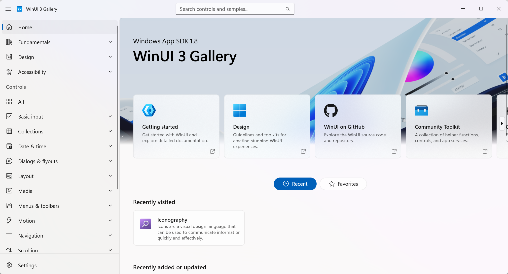

# ClipBridge 项目文档

# 0) 项目简介

- **名称**：ClipBridge（简称 **CB**）
- **定位**：跨平台剪贴板同步工具，先 **局域网 (LAN)**，后期支持 **跨外网 (WAN)**。
- **核心卖点**：**Lazy Fetch 按需取用**——复制时只广播**元数据**，粘贴时才向源设备拉取**正文**（文本/图片/文件），节省网络与功耗。
- **目标平台**：Windows（先做外壳 MVP）→ Android（外壳）→ v1 核心（剪贴板历史与同步）→ macOS / Linux（外壳）。
- **编译指令**：
  - WinUI / C# shell 调用 Rust DLL（只构建名为 core-ffi-windows 的 crate）：`cargo build -p core-ffi-windows --release --target x86_64-pc-windows-msvc`
  - 全量测试（构建整个 workspace 所有成员）：`cargo build --release --target x86_64-pc-windows-msvc
  `
------

# 1) 功能与阶段目标

## v1（Windows MVP + 基础核心）

- 局域网自动发现
- 端到端加密连接
- 同局域网内多设备同账号之间共享剪切板
- **Lazy Fetch**：复制时广播“元数据”，粘贴时拉取正文
- **剪贴板历史**：本地持久化（SQLite/KV），在各设备同步**历史元数据**；
- 支持类型：**文本**、**图片**、**文件**（先不管应用内复制和特殊格式）
- Windows 外壳：托盘图标、主窗口、呼出小窗
- 全局热键：默认 **Ctrl+Shift+V**（Win+V 为系统保留）

## v2（核心升级 + 历史）

- Android外壳
- 添加云端账号，可以云端同步剪切板
- 定向传输文件

## 未来

- macOS / Linux 外壳
- 同账号内设备分组共享

------

# 2) 功能细节

## 2.1 Core / Shell 分工

### 2.1.1 Rust 内核（Core）——“网络 + 协议 + 数据权威层”

Core 负责所有**跨平台一致**、与 UI 无关的能力，并且是“设备/会话/数据”的唯一权威来源：

* **局域网发现（Discovery）**

    * mDNS 广播与扫描（服务发布、TXT 解析、设备列表维护）
    * 设备在线/离线判定（心跳/超时/去抖）

* **连接与会话（Transport & Session）**

    * 建立/维护局域网连接：优先 QUIC（失败可降级 TCP）
    * 会话生命周期：握手、重连、并发流、超时、取消、流控
    * 传输进度与错误归一化（统一回调给壳）

* **安全与信任（Identity & Trust）**

    * 生成/持有设备身份（device_id + keypair）
    * 配对流程状态机（未配对/待确认/已信任/已撤销）
    * 连接加密（TLS 1.3 / rustls），证书/公钥指纹 pinning
    * 信任库的逻辑管理（具体密钥落地存储可由壳提供）

* **协议与数据同步（Protocol）**

    * 元数据广播/点对点同步（ItemMeta）
    * Lazy Fetch：按需向源设备拉取正文（文本/图片/文件）
    * 请求路由：处理其他设备的内容请求并回传数据流
    * 版本协商：`protocol_version`、向后兼容解析

* **历史/数据库/缓存（Persistence）**

    * SQLite / KV：devices / items / history / cache 索引
    * 内容缓存 CAS（按 sha256 存 blob 文件），DB 仅存引用与状态
    * 清理策略：容量上限 / TTL / LRU / 历史上限
    * 去重（同 hash 内容不重复缓存、不重复广播）

* **对外接口（Core API）**

    * 向壳暴露稳定 API（FFI / callback）
    * 以事件驱动方式通知壳：设备上下线、新元数据、传输进度、错误等

### 2.1.2 平台外壳（Shell）

Shell 负责所有**强依赖平台 API / 权限 / UI 交互**的能力，不直接实现网络协议，只通过 Core API 与内核交互：

* **系统剪贴板集成**

    * 监听系统剪贴板变化（copy）
    * 读取本机剪贴板内容并生成 `ClipboardSnapshot`（bytes / 路径 / mime / 预览）
    * 写入系统剪贴板（paste）
    * 平台特性：延迟渲染 / Promise 数据（粘贴触发时再向 Core 拉正文）

* **本地内容提供者（Local Content Provider）**

    * 当 Core 需要发送正文时，按需从系统取内容：

        * 文本：读取字符串
        * 图片：导出指定格式 bytes
        * 文件：读取文件 bytes / 打开文件流（受权限限制时由壳处理授权）
    * 对于“无稳定路径”的内容（如临时图片/截图），由壳先落盘到受控目录，再把引用交给 Core

* **系统能力与权限**

    * 系统安全存储：Keychain / Credential Manager / Android Keystore（供 Core 读写密钥/配对信息）
    * 开机启动、后台常驻策略、通知（Android 前台服务等）
    * 网络权限/本地网络权限申请与提示（平台差异由壳处理）

* **UI 与交互**

    * 托盘图标、主窗口、历史面板、小窗、设置页
    * 全局热键（如 Ctrl+Shift+V）、快捷操作
    * 配对确认 UI：展示对端设备信息与指纹，让用户确认/拒绝
    * 错误提示与状态展示（在线设备、传输进度、失败原因）

* **与 Core 的交互原则**

    * Shell 不维护“设备权威列表”和“会话状态”，只消费 Core 事件
    * Shell 不实现协议细节（广播/拉取/重试/流控），只调用 Core API。

---

## 2.2 网络与安全（功能细节）

本节从**功能与行为视角**描述 ClipBridge 的网络与安全模型，重点说明“系统如何工作”，而非具体代码实现。

ClipBridge 的网络与安全设计采用**分层模型**，从低到高依次为：

1. **连接层（Connectivity）**
2. **安全传输层（Secure Transport）**
3. **账号证明层（Account Authentication）**
4. **权限与策略层（Authorization & Policy）**

每一层职责单一、边界清晰，上层能力不得绕过下层直接使用。

---

### 2.2.1 连接层（Connectivity / Discovery）

连接层负责解决两个问题：

* **“我能看见哪些设备？”**
* **“我该尝试连接到哪里？”**

#### 局域网发现（Discovery）

* ClipBridge 使用 **mDNS / DNS-SD** 在局域网内进行设备发现。
* 每个设备在登录账号后，广播一个 ClipBridge 服务实例。
* 广播内容包含一个**不可逆的账号标识 `account_tag`**，用于区分不同账号的设备集合。

#### 同账号自动发现

* `account_tag` 由账号密码通过 KDF + HMAC 派生而来：

    * 同账号设备必然拥有相同的 `account_tag`
    * 不同账号即使在同一局域网也无法互相发现
* mDNS 监听端只缓存与当前账号 `account_tag` 匹配的设备。

#### 发现层的安全边界

* 发现层**不做任何信任判断**：

    * 不验证身份
    * 不验证账号
    * 不授予权限
* mDNS 发现仅提供**连接候选线索**，真实身份与授权必须在后续层级完成。

---

### 2.2.2 安全传输层（Secure Transport）

安全传输层负责解决：

* **“连接是否加密？”**
* **“传输过程中是否能被窃听或篡改？”**

#### 连接方式

* 默认使用 **QUIC（基于 UDP）**
* 在 QUIC 不可用的情况下可降级为 TCP（策略保持一致）

#### 加密与完整性

* 所有连接均通过 **TLS 1.3** 建立加密通道：

    * 防止被动监听
    * 防止中间人篡改
* 每个设备拥有独立的设备密钥对，用于生成自签名证书或公钥标识。

#### 传输层与信任的区分

* TLS 只保证：

    * “这条连接是加密的”
* TLS **不保证**：

    * 对端属于哪个账号
    * 对端是否被允许访问剪贴板数据

账号归属与权限控制必须由更高层完成。

---

### 2.2.3 账号证明层（Account Authentication / OPAQUE）

账号证明层解决的问题是：

> **“我们是否属于同一个账号？”**

#### 设计原则

* 不在网络中暴露账号密码
* 不允许离线撞库
* 不依赖中心服务器（LAN 可完全离线）

#### OPAQUE 协议

* ClipBridge 使用 **OPAQUE PAKE** 作为账号证明协议。
* 在安全传输层建立后，双方通过 OPAQUE 完成账号证明：

    * 若双方输入过相同账号密码 → 验证成功
    * 否则失败，连接被降权

#### OPAQUE 的角色分配

* 连接发起方：OPAQUE Client
* 被连接方：OPAQUE Server
* 每个设备本地同时保存 Client / Server 所需的注册记录。

#### 账号验证结果

* **成功**：
    * 会话升级为 *AccountVerified*
    * 允许进入权限判定阶段
* **失败**：
    * 不允许同步任何剪贴板元数据或正文
    * 可记录失败并进入退避状态

说明：
OPAQUE 用于证明账号归属；设备公钥指纹 pinning 用于保证设备连续性。
在同账号前提下，若检测到已信任设备的指纹发生变化，连接应被拒绝并提示潜在风险。

#### 2.2.3.1 账号对象与本地记录

ClipBridge 的“账号”是一个**本地账号域（Account Domain）**，用于将同一套账号密码输入的设备归为一组，并在 LAN 环境下实现离线认证与自动共享。

**账号由三类核心要素组成：**

* **账号主键 `account_uid`（本地唯一）**
  用于在本机数据库中标识一个账号。它是本地权威主键，稳定且不依赖 IP/设备。

* **发现标签 `account_tag`（用于 LAN 发现过滤）**
  由账号密码经 KDF + HMAC 派生，用于 mDNS 发现层筛选同账号设备。
  `account_tag` 只作为“发现过滤”，**不是权限或信任根**。

* **OPAQUE 注册记录（每台设备各自保存）**
  每台设备在“登录/创建账号”后，会在本机保存 OPAQUE 的 Client/Server 注册记录。
  这些记录用于后续 OPAQUE 握手，**不需要也不应跨设备同步**。

**账号切换原则：**
同一时间 Core 只允许存在一个 `ActiveAccount`；切换账号会导致发现过滤、会话认证与权限策略全部切换到新的账号域。
---

### 2.2.4 权限与策略层（Authorization & Policy）

权限层解决的问题是：

> **“这个设备现在能做什么？”**

##### 默认权限模型（同账号）

* 同账号、OPAQUE 验证通过的设备：

    * 默认允许互相发送剪贴板元数据
    * 默认允许 Lazy Fetch 拉取正文
* 用户可在 UI 中手动关闭：

    * 向某设备发送
    * 从某设备接收

##### 临时跨账号授权（可选）

* ClipBridge 支持通过 **临时邀请（Invite）** 的方式：

    * 向其他账号的某一台设备**单向共享剪贴板**
* 临时授权具有：

    * 明确的方向（A → B）
    * 明确的范围（仅元数据 / 允许正文 / 文件大小限制）
    * 明确的时效（TTL）

##### 权限判定原则

* 未通过账号证明的连接：

    * 默认无任何数据访问权限
* 权限判断始终发生在**实际数据发送/拉取之前**

#### 2.2.4.1 策略模型：规则（Rules）+ 临时授权（Grants）

权限与策略层采用“双模型”以同时覆盖「同账号长期共享」与「跨账号临时共享」：

1. **长期规则 PeerRule（Rules）**

* 作用域：`(account_uid, peer_device_id)`
* 用途：控制“同账号设备之间”的默认行为
* 支持：

    * 启用/禁用该设备
    * 方向：双向 / 仅发送 / 仅接收
    * 范围：仅元数据 / 允许正文 / 允许文件
    * 限制：自动拉取大小、文件大小、请求频率、并发上限

2. **临时授权 TemporaryGrant（Grants）**

* 作用域：绑定到某个 `peer_device_id`，带 TTL（过期自动失效）
* 用途：允许“跨账号单向共享/短期共享”
* 特点：

    * 明确方向、范围、限制与过期时间
    * 可撤销（revoked）

**策略判定顺序（固定）：**

* 若会话已通过 OPAQUE 且属于当前 `ActiveAccount` → 使用 PeerRule 判定
* 否则 → 检查 TemporaryGrant（未过期/未撤销）
* 否则 → 拒绝（`PERMISSION_DENIED`）


---
### 2.2.5 连接模型与复用（功能细节）

本节定义 ClipBridge 在网络侧对“连接”的抽象方式，用于支撑 Lazy Fetch 与后续文件传输，同时避免频繁建链带来的延迟与不稳定。

#### 2.2.5.1 核心抽象：Session / Stream

ClipBridge 将“连接”分为两层抽象：

* **Session（逻辑会话）**
  表示“本机与某一台对端设备”的一条长期逻辑会话。Session 的生命周期通常跨越多次复制/粘贴行为，持续数分钟到数小时。

* **Stream / Channel（会话内通道）**
  在同一 Session 内，按用途打开不同的逻辑通道来承载不同类型的消息与数据流，互不阻塞。

在默认使用 QUIC 时，Stream 直接映射为 QUIC streams；在 TCP fallback 时，Stream 由应用层多路复用（或多连接）模拟。

#### 2.2.5.2 通道分类（建议最小集合）

为了让控制消息不被大内容阻塞，至少划分为：

1. **Control 通道（长期）**

    * 连接建立后立即创建并保持
    * 承载：握手、心跳、设备状态、元数据事件、进度通知、错误通知
    * 特点：小包、高优先级、低延迟

2. **Content 通道（按需）**

    * Lazy Fetch 拉取正文时按需创建
    * 承载：`GET item content`（文本/图片/文件片段）
    * 特点：可取消、可超时、并发数量受限

3. **File 通道（按需，后续扩展）**

    * 大文件或定向传输使用
    * 特点：强流控、可分块、可恢复（v2+）

#### 2.2.5.3 为什么必须复用 Session

* **降低粘贴延迟**：粘贴触发时如果还要重新握手/重建连接，用户体感会明显卡顿
* **提高稳定性**：局域网频繁切换（Wi-Fi/有线、睡眠唤醒、DHCP 换 IP）时，持久 Session + 重连策略更可靠
* **隔离大流量影响**：文件/图片拉取不应阻塞设备状态与元数据通知
* **支撑并发**：多台设备同时在线、同时拉取/推送时，需要会话级资源控制

---

### 2.2.6 连接状态机（功能细节）

本节定义对每个对端设备的连接状态模型，用于统一 UI 展示、重连策略与权限控制。

#### 2.2.6.1 状态列表（推荐 v1 最小闭环）

对每个 peer 维护一个状态机（只要实现这些就够）：

* **Discovered**：已通过 mDNS 获得候选地址/端口（仅线索，不代表可连接）
* **Connecting**：正在建立 QUIC/TCP 连接（Transport handshake）
* **TransportReady**：传输层已加密建立（TLS OK），但尚未完成账号证明
* **AccountVerifying**：正在进行 OPAQUE 握手
* **AccountVerified**：账号证明成功（同账号确认），会话已具备进入权限判定的条件
* **Online**：会话稳定在线（Control 通道可用、心跳正常），可进行数据交换。
* **Backoff**：最近连接失败，进入指数退避等待下一次重试
* **Offline**：长时间不可达或明确断开

> 说明：`AccountVerified` 与 `Online` 可合并，但拆开有助于更清楚地区分“验证成功”和“链路健康”。

#### 2.2.6.2 各状态的能力边界（非常重要）

* **Discovered / Connecting**：不允许任何数据同步
* **TransportReady / AccountVerifying**：只允许握手消息，不允许元数据/正文
* **AccountVerified / Online**：进入 Policy 判定，允许/拒绝具体操作
* **Backoff / Offline**：不允许同步，可保留历史与 UI 显示

这样可以避免“还没证明同账号就开始收发元数据”的逻辑漏洞。

#### 2.2.6.3 状态迁移的主要触发事件

* mDNS 发现/更新 → `Discovered`（更新候选地址）
* 连接成功（TLS OK）→ `TransportReady`
* OPAQUE 成功 → `AccountVerified` → `Online`
* 心跳超时/连接断开 → `Backoff` 或 `Offline`
* 指数退避到点 → `Connecting`

---

### 2.2.7 重连与换 IP（功能细节）

局域网环境中，设备离线、睡眠、IP 变化是常态。本节定义 ClipBridge 的“稳定在线”行为原则。

#### 2.2.7.1 身份不依赖网络地址

* 对端身份由 `device_id`（以及后续的设备密钥指纹）标识
* IP/端口仅是“可达性线索”，可随时变化
* mDNS 提供的地址更新不改变设备身份，只更新“拨号目标”

#### 2.2.7.2 心跳与离线判定（建议策略）

* `Online` 状态维持一个轻量心跳（通过 Control 通道）
* 若连续 N 次心跳失败或超过 `heartbeat_timeout`：

    * 进入 `Backoff`
* 若超过较长时间仍无法恢复：

    * 进入 `Offline`（UI 可显示“离线”）

#### 2.2.7.3 指数退避（Backoff）

连接失败后采用指数退避重试，推荐：

* 1s → 2s → 4s → 8s → … → max 60s
* 成功一次后退避重置

目的：

* 避免网络波动时疯狂重连占用资源
* 避免被恶意设备诱导连接风暴

#### 2.2.7.4 地址变化处理（DHCP / 多网卡）

* mDNS 监听到同一 `device_id` 的新地址：

    * 更新候选地址列表（IPv4/IPv6 都可保留）
* 若已有在线 Session：

    * 不立即断开，仅在连接异常或需要重连时使用最新地址
* 若处于 `Backoff/Offline`：

    * 使用最新地址优先尝试

---


## 2.4 外壳要点

- **Windows**：
  * Win32 延迟渲染
  * C#/WinUI 3 外壳。
  * 快捷键呼起剪切板历史小窗（就像win+v），可以选择要复制的历史剪切板内容
  * 任务栏常驻图标，左键打开主窗口，右键是选项栏
- **Android**（Java 外壳，后继）：
  * 常驻通知显示当前复制内容
  * 后台长期运行
  * 通过 **ContentProvider URI** 提供大内容（粘贴时触发拉取）；
  * JNI 调 Rust FFI `.so`（非必须先做）。

------

# 3) 技术实现

## 3.1 语言/框架

- **核心**：Rust
- **Windows 外壳**：C# + WinUI 3（C#/WinRT），必要处使用 Win32 API
- **Android 外壳**：Java（UI 设计器），JNI 连接 Rust（后做）

## 3.2 Core ↔ Shell 接口（方向）
### 3.2.1 Windows端
- Shell → Core：`cb_init(config) / cb_send_metadata(meta) / cb_request_content(item_id, mime) / cb_pause(bool) / cb_shutdown()`
- Core → Shell（回调）：`on_device_online(info) / on_device_offline(id) / on_new_metadata(meta) / on_transfer_progress(id, sent, total) / on_error(code,msg)`

## 3.3 网络与安全（技术实现）

本节从**实现视角**描述网络与安全模块在 Core 中的结构、接口与状态机。

---

### 3.3.1 模块划分

Core 内部网络与安全相关模块建议拆分为：

* `AccountManager`
* `DiscoveryService`
* `SessionManager`
* `OpaqueAuth`
* `PolicyEngine`

#### 3.3.1.1 数据权威边界（Single Source of Truth）

为避免 Shell 与 Core 重复维护状态，Core 内部的数据权威边界如下：

* **AccountManager**：账号域权威（`ActiveAccount`、OPAQUE 记录解密态、account_tag）
* **SessionManager**：设备会话权威（peer 列表、连接状态机、重连/退避、streams）
* **PolicyEngine / PolicyStore**：权限权威（PeerRule、TemporaryGrant、判定顺序）

Shell 仅负责展示与用户输入，不维护权威状态；所有“是否在线/是否允许/失败原因”等由 Core 事件上报。

---

### 3.3.2 DiscoveryService（发现实现）

#### 职责

* 发布 mDNS 服务
* 监听并解析局域网内的 ClipBridge 服务实例
* 根据 `account_tag` 过滤候选设备

#### mDNS TXT 字段示例

* `acct=<account_tag>`
* `did=<device_id>`
* `proto=1`
* `cap=txt,img,file`

#### 输出

* `PeerCandidate`：

    * device_id
    * socket addresses
    * capabilities
    * last_seen

---

### 3.3.3 SessionManager（连接与会话）

#### 会话生命周期

  * Discovered
  * Connecting
  * TransportReady
  * AccountVerifying
  * AccountVerified
  * Online
  * Backoff
  * Offline

#### 连接策略

* 控制最大并发连接数
* 对失败连接执行指数退避
* QUIC 连接上复用多条 stream：

    * 控制流
    * 内容流
    * 文件流

---

### 3.3.4 OpaqueAuth（账号证明）

##### 数据存储

* 每个账号本地保存：

    * OPAQUE Client Registration Record
    * OPAQUE Server Registration Record
* 记录通过系统安全存储或加密文件保存。

##### 握手流程（简化）

1. HELLO（包含 account_tag）
2. OPAQUE Start（Client）
3. OPAQUE Response（Server）
4. OPAQUE Finish（Client）
5. AUTH_OK / AUTH_FAIL

##### 安全属性

* 不暴露密码
* 抗中间人
* 抗离线撞库

#### 3.3.4.1 OPAQUE 记录存储与轮换

本机对每个账号维护两份 OPAQUE 注册记录：

* `OpaqueRecord(role=Client)`
* `OpaqueRecord(role=Server)`

记录以二进制 blob 形式保存，并要求 **静态加密（at-rest encryption）**：

* ciphertext 存 SQLite
* wrap_key / keystore 由 Shell 提供或托管（Windows Credential Manager / macOS Keychain / Android Keystore）

密码更改或安全升级时支持轮换：

* 生成新记录并更新 `record_version`
* 旧记录保留或清理由策略决定（推荐保留一段时间用于回滚）

---

### 3.3.5 PolicyEngine（权限判定）

#### 判定输入

* 连接类型（账号 / 临时授权）
* 对端 device_id
* 请求类型（广播 / 拉取正文 / 文件）

#### 判定输出

* `ALLOW`
* `DENY`
* `LIMITED`（受限大小 / 频率）

#### 判定调用点

* 发送元数据前
* 接收拉取请求前
* 文件流建立前

#### 3.3.5.1 PeerRule / TemporaryGrant 数据模型定型

PolicyEngine 的判定数据来自两类存储对象：

* `PeerRule(account_uid, peer_id)`：同账号长期规则（默认自动创建）
* `TemporaryGrant(grant_id, peer_id)`：临时授权（跨账号/短期）

PolicyEngine 判定 API（概念）：

* 输入：

    * `active_account_uid`（可空）
    * `peer_id`
    * `session_is_account_verified`
    * `request_kind`（SendMeta / ReceiveMeta / FetchContent / SendFile / ReceiveFile）
* 输出：`ALLOW / DENY(code) / LIMITED(limits)`

判定顺序固定：

1. 若 `session_is_account_verified` 且 `active_account_uid` 存在 → 查 `PeerRule`
2. 否则 → 查未过期且未撤销的 `TemporaryGrant`
3. 否则 → `DENY(PERMISSION_DENIED)`

---

### 3.3.6 与 Shell 的交互

* Core 向 Shell 上报：

    * 新设备上线（含账号验证状态）
    * 账号不匹配 / 验证失败
    * 权限拒绝原因（用于 UI 提示）
* Shell 不参与协议与安全判断，仅展示与配置策略。

---

### 3.3.7 向未来 WAN 的兼容性

* LAN 发现（mDNS）可替换为云端 rendezvous
* OPAQUE 协议保持不变
* 权限与策略模型保持不变
* 仅“候选地址来源”发生变化

---

### 3.3.8 Session 抽象与状态机实现（技术实现）

本节给出 Core 内部可落地的实现结构，用于支撑 2.2.5～2.2.7 的行为。

#### 3.3.8.1 关键数据结构（概念级）

* `PeerId = device_id`

* `PeerCandidate`：来自 Discovery 的候选信息

    * `peer_id`
    * `addrs: Vec<SocketAddr>`
    * `capabilities`
    * `last_seen`

* `Session`：与某 peer 的会话对象

    * `peer_id`
    * `state`
    * `transport`（QUIC/TCP 的统一抽象）
    * `control_channel`
    * `last_heartbeat_at`
    * `backoff`（当前退避计时器）
    * `limits`（并发 stream 上限、速率限制等）

* `SessionState`：对应 2.2.6 定义的枚举状态

#### 3.3.8.2 SessionManager 的职责

* 维护 `HashMap<PeerId, Session>`
* 订阅 Discovery 输出的候选设备变更（增量更新）
* 负责：

    * 连接建立与拆除
    * 握手推进（Transport → App）
    * 心跳与超时
    * backoff 调度
    * stream 并发限制
    * 统一向上抛事件（设备上线/离线、失败原因）

#### 3.3.8.3 状态推进原则（实现规则）

* 状态只能由 SessionManager 推进（单写者），避免竞态
* 所有网络 IO 事件、定时器事件进入同一事件循环（tokio task）
* 状态迁移必须记录原因（用于日志与 UI）：

    * `connect_error`
    * `tls_error`
    * `opaque_fail`
    * `heartbeat_timeout`

#### 3.3.8.4 Session 对象字段定型（权威字段）

每个 `Session(peer_id)` 至少包含以下权威字段：

* `peer_id`：设备唯一标识（device_id），不依赖 IP
* `state`：状态机状态（Discovered/Connecting/.../Online）
* `candidate_addrs`：来自 Discovery 的候选地址池（可频繁更新）
* `selected_addr`：当前拨号使用地址（可为空）
* `transport`：QUIC/TCP 传输句柄（可为空，随状态变化）
* `control_channel`：常驻控制通道（Online 必须存在）
* `limits`：并发、超时、心跳、握手超时等硬限制
* `health`：心跳、rtt、失败计数等健康度指标
* `recent_msg_ids`：短期去重/重放保护（可选但推荐）

不变量：任何剪贴板数据操作必须满足
`state ∈ {AccountVerified, Online}` 且 `PolicyEngine` 判定为允许。

---

### 3.3.9 双阶段握手：Transport Handshake + Application Handshake（技术实现）

#### 3.3.9.1 Transport Handshake（QUIC/TLS）

* 尝试使用 QUIC 建立连接：

    * `Connecting -> TransportReady`
* TLS 1.3 由 QUIC 内置完成
* 建议实现“证书/公钥指纹 pinning”接口：

    * 若未来启用 device pinning：

        * 首次见到对端指纹：上报 Shell 让用户确认
        * 已确认后：写入 trust store
        * 以后若指纹变化：拒绝连接并上报风险

> 注：同账号证明主要靠 OPAQUE；pinning 更像“设备连续性防护”（防止同账号内冒充某台旧设备）。

#### 3.3.9.2 Application Handshake（HELLO + OPAQUE）

在 `TransportReady` 后，通过 Control 通道执行应用握手：

**(1) HELLO**

* Client → Server：发送 `HELLO`（含 `protocol_version`、`device_id`、`account_tag`、capabilities）
* Server 校验：

    * `account_tag` 是否与本机 active account 一致
    * 不一致直接 `REJECT_ACCOUNT_TAG`

**(2) OPAQUE（账号证明）**

* Client → Server：`OPAQUE_START (ke1)`
* Server → Client：`OPAQUE_RESPONSE (ke2)`
* Client → Server：`OPAQUE_FINISH (ke3)`
* 成功：进入 `AccountVerified`

**(3) AUTH_OK**

* Server → Client：`AUTH_OK`（可含会话参数、限制、对端能力确认）
* 会话进入 `Online`

#### 3.3.9.3 失败处理与退避

* 任一步失败都不得降级为“匿名在线”
* 失败进入 `Backoff`，并记录失败原因
* 对同一 `(peer_id, addr)` 连续失败可拉长 backoff，避免被噪声设备拖垮

---

### 3.3.10 连接复用、并发限制、重连与地址变更（技术实现）

#### 3.3.10.1 连接复用（Streams）

在 `Online` 状态下：

* `control_channel`：保持常驻
* `content_stream`：每次 Lazy Fetch 请求新建一个 stream
* `file_stream`：大文件/定向传输单独 stream（后续扩展）

#### 3.3.10.2 并发与资源上限（建议实现为硬限制）

建议至少实现这些限制字段（可配置）：

* 每 peer 最大同时 content streams：例如 4
* 全局最大同时 content streams：例如 16
* 每 peer 最大同时 file streams：例如 1
* 全局最大同时 file streams：例如 4

目的：

* 防止多设备同时粘贴导致资源爆炸
* 防止对端恶意反复拉取

#### 3.3.10.3 心跳与超时

* Control 通道定期发送 `PING`
* 超时策略：

    * 若超过 `heartbeat_timeout` 未收到对端响应：`Online -> Backoff`
* 重连成功后：

    * 退避重置
    * 重新建立 control_channel 并重新握手（HELLO + OPAQUE）

#### 3.3.10.4 地址变化（DHCP / 多网卡）

DiscoveryService 更新 `PeerCandidate.addrs` 后：

* SessionManager 更新 session 的“拨号地址池”
* 若 session 当前在线：

    * 不立刻迁移，避免无意义抖动
* 若 session 断线重连：

    * 按优先级尝试最新 addr（可用 `last_seen` 时间排序）

#### 3.3.10.5 Backoff 调度（指数退避）

实现要点：

* 每个 session 维护 `backoff_step` 与 `next_retry_at`
* 典型序列：1,2,4,8,…,60（秒）
* 成功一次后将 `backoff_step` 清零

---
下面是**仅新增**的内容，可直接追加到你现有文档中，作为 **3.3.11 消息类型与错误码（技术实现）**。
内容目标是：**让网络/安全/会话这套设计“在协议层彻底闭环”**，避免后期实现时消息随意增长、错误码混乱。

---

### 3.3.11 消息类型与错误码

本节定义 ClipBridge 在 **Control 通道** 与 **Data 通道** 中使用的消息类型与错误码规范，用于保证跨设备通信的一致性、可调试性与可扩展性。

---

#### 3.3.11.1 消息通道划分

所有网络消息均隶属于某个通道（Stream / Channel）：

* **Control 通道（必须）**

    * 长连接、低延迟
    * 承载：握手、状态、事件、心跳、错误
* **Content 通道（按需）**

    * Lazy Fetch 拉取正文
* **File 通道（按需，后续扩展）**

    * 大文件/定向传输

> 原则：
> **所有“决定连接状态、权限、会话生死”的消息必须走 Control 通道。**

---

#### 3.3.11.2 Control 通道消息类型

##### A. 握手与认证类

###### `HELLO`

* **方向**：Client → Server
* **用途**：应用层握手起点，声明协议与账号上下文

字段示例：

```json
{
  "type": "HELLO",
  "protocol_version": 1,
  "device_id": "uuid",
  "account_tag": "hex-string",
  "capabilities": ["text","image","file"],
  "client_nonce": "base64"
}
```

---

###### `HELLO_ACK`

* **方向**：Server → Client
* **用途**：确认 HELLO 可继续，进入 OPAQUE

```json
{
  "type": "HELLO_ACK",
  "server_device_id": "uuid",
  "protocol_version": 1
}
```

---

###### `OPAQUE_START`

* **方向**：Client → Server
* **用途**：OPAQUE 第一步（ke1）

```json
{
  "type": "OPAQUE_START",
  "opaque": "base64-bytes"
}
```

---

###### `OPAQUE_RESPONSE`

* **方向**：Server → Client
* **用途**：OPAQUE 第二步（ke2）

```json
{
  "type": "OPAQUE_RESPONSE",
  "opaque": "base64-bytes"
}
```

---

###### `OPAQUE_FINISH`

* **方向**：Client → Server
* **用途**：OPAQUE 第三步（ke3）

```json
{
  "type": "OPAQUE_FINISH",
  "opaque": "base64-bytes"
}
```

---

###### `AUTH_OK`

* **方向**：Server → Client
* **用途**：账号证明成功，会话升级为 AccountVerified / Online

```json
{
  "type": "AUTH_OK",
  "session_flags": {
    "account_verified": true
  }
}
```

---

###### `AUTH_FAIL`

* **方向**：Server → Client
* **用途**：账号证明失败，连接将进入 Backoff

```json
{
  "type": "AUTH_FAIL",
  "error_code": "OPAQUE_FAILED"
}
```

---

##### B. 会话与状态类

###### `PING`

* **方向**：双向
* **用途**：心跳与存活检测

```json
{
  "type": "PING",
  "ts": 1700000000
}
```

---

###### `PONG`

* **方向**：双向
* **用途**：心跳响应

```json
{
  "type": "PONG",
  "ts": 1700000000
}
```

---

###### `DEVICE_STATUS`

* **方向**：Server → Client
* **用途**：对端状态变化通知（在线/离线/能力变化）

```json
{
  "type": "DEVICE_STATUS",
  "state": "ONLINE"
}
```

---

##### C. 剪贴板元数据类

###### `ITEM_META`

* **方向**：Server → Client
* **用途**：广播新的剪贴板元数据

```json
{
  "type": "ITEM_META",
  "item": {  }
}
```
item里放ItemMeta
---

##### D. 错误与控制类

###### `ERROR`

* **方向**：双向
* **用途**：通用错误返回（非致命）

```json
{
  "type": "ERROR",
  "error_code": "PERMISSION_DENIED",
  "message": "Not allowed to fetch content"
}
```

---

###### `CLOSE`

* **方向**：双向
* **用途**：正常关闭会话（非异常）

```json
{
  "type": "CLOSE",
  "reason": "CLIENT_SHUTDOWN"
}
```

---

#### 3.3.11.3 Content / File 通道消息类型

##### GET_ITEM_CONTENT

* **方向**：Client → Server
* **用途**：Lazy Fetch 请求正文

```json
{
  "type": "GET_ITEM_CONTENT",
  "item_id": "uuid",
  "mime": "text/plain"
}
```

---

##### ITEM_CONTENT_DATA

* **方向**：Server → Client
* **用途**：流式发送正文数据块

```json
{
  "type": "ITEM_CONTENT_DATA",
  "seq": 3,
  "eof": false,
  "data": "base64"
}
```

---

##### ITEM_CONTENT_END

* **方向**：Server → Client
* **用途**：正文传输完成

```json
{
  "type": "ITEM_CONTENT_END"
}
```

---

##### CANCEL

* **方向**：Client → Server
* **用途**：取消正在进行的内容/文件传输

```json
{
  "type": "CANCEL",
  "reason": "USER_CANCEL"
}
```

---

#### 3.3.11.4 错误码设计（统一规范）

错误码采用 **分层前缀 + 语义枚举** 的方式，便于调试与 UI 显示。

---

##### A. 通用错误（GEN）

| 错误码                     | 含义      |
| ----------------------- | ------- |
| `GEN_INVALID_MESSAGE`   | 消息格式错误  |
| `GEN_PROTOCOL_MISMATCH` | 协议版本不兼容 |
| `GEN_INTERNAL_ERROR`    | 内部错误    |

---

##### B. 连接与传输（CONN）

| 错误码            | 含义      |
| -------------- | ------- |
| `CONN_TIMEOUT` | 连接/响应超时 |
| `CONN_CLOSED`  | 对端关闭连接  |
| `CONN_BACKOFF` | 当前处于退避期 |

---

##### C. 安全传输（TLS）

| 错误码                    | 含义            |
| ---------------------- | ------------- |
| `TLS_HANDSHAKE_FAILED` | TLS/QUIC 握手失败 |
| `TLS_PIN_MISMATCH`     | 设备指纹不匹配       |

---

##### D. 账号证明（AUTH / OPAQUE）

| 错误码                         | 含义          |
| --------------------------- | ----------- |
| `AUTH_ACCOUNT_TAG_MISMATCH` | 账号不一致       |
| `OPAQUE_FAILED`             | OPAQUE 验证失败 |
| `AUTH_REVOKED`              | 账号或设备已被撤销   |

---

##### E. 权限与策略（POLICY）

| 错误码                 | 含义       |
| ------------------- | -------- |
| `PERMISSION_DENIED` | 权限不足     |
| `SHARE_EXPIRED`     | 临时授权已过期  |
| `CONTENT_TOO_LARGE` | 内容超过允许大小 |
| `RATE_LIMITED`      | 触发限流     |

---

##### F. 内容与资源（CONTENT）

| 错误码                   | 含义    |
| --------------------- | ----- |
| `ITEM_NOT_FOUND`      | 条目不存在 |
| `ITEM_EXPIRED`        | 条目已过期 |
| `CONTENT_UNAVAILABLE` | 正文不可用 |
| `TRANSFER_CANCELLED`  | 传输被取消 |

---

#### 3.3.11.5 错误码使用原则（必须遵守）

1. **错误码用于程序逻辑，message 仅用于人类阅读**
2. **权限错误不得自动重试**（避免无意义请求）
3. **OPAQUE / AUTH 错误直接进入 Backoff**
4. **所有错误都必须能映射到 Session 状态变化或 UI 提示**

---

#### 3.3.11.6 与 Session / Policy 的关联点

* 握手类错误：

    * 影响 Session 状态迁移（Connecting → Backoff）
* 权限类错误：

    * 不影响 Session 在线状态
    * 仅影响具体请求
* 内容类错误：

    * 影响单个 Stream，不影响 Session

---


------

# 4) Rust核心
## 4.1 设计原则

* **共享内核**：所有跨平台逻辑尽量放 Core（发现/会话、协议、缓存、历史、Lazy Fetch）。
* **按需取用**（Lazy Fetch）：复制只广播**元数据**；粘贴/点击时才拉**正文**。
* **事件驱动**：Core 通过回调把设备上下线/新元数据/传输进度推给壳。
* **可演进协议**：带 `protocol_version`；新增字段向后兼容。
* **低耦合**：壳只做系统集成（UI、剪贴板、托盘、热键、系统秘钥存取）。

---

## 4.2 Core Rust 公共 API（给壳/FFI 上层用）

### 4.2.1 生命周期与配置

```rust

```

### 4.2.2 安全存储（由壳实现，Core 调用）

```rust

```

### 4.2.3 业务入口（壳 → Core）

```rust

```

---

## 4.2 数据模型（Core 层 DTO）

```rust

```

---

## 4.3 错误与版本

```rust

```

---

## 4.4 FFI（C ABI）接口

### 4.4.1 C 头文件（壳侧直接包含）

```c

```

> 说明：
>
> * **序列化统一用 JSON**，跨语言最省事；字段就是 Rust DTO/协议的镜像。
> * FFI 返回字符串由 Core 分配，壳侧必须调用 `cb_free` 释放。
> * 回调也统一 JSON 负载，避免结构体对齐问题。

---

## 4.5 协议与通信流程（Protocol & Communication）

本章描述 ClipBridge 在设备间进行通信时的**协议语义与交互流程**。
本章不重复底层实现细节，所有消息格式、错误码与通道定义以 **3.3.11** 为准。

---

### 4.5.1 协议设计原则

ClipBridge 的通信协议遵循以下原则：

1. **分层清晰**

    * 发现、连接、安全、权限、数据传输各司其职
2. **长会话 + 多路复用**

    * 单个 Session 承载多种逻辑流（Control / Content / File）
3. **默认最小权限**

    * 未完成账号证明或权限判定前，不允许任何剪贴板数据交换
4. **Lazy Fetch**

    * 默认仅同步元数据，正文按需拉取
5. **LAN / WAN 可演进**

    * 协议不依赖具体网络拓扑，仅依赖“可达连接”

---

### 4.5.2 设备发现与连接建立

#### 4.5.2.1 局域网发现（Discovery）

ClipBridge 使用 **mDNS / DNS-SD** 在局域网内广播服务实例。

* **服务类型**

    * `_clipbridge._udp.local`（默认，QUIC）
    * `_clipbridge._tcp.local`（可选 fallback）

* **TXT 记录最小字段**

    * `acct=<account_tag>`
    * `did=<device_id>`
    * `proto=1`
    * `cap=txt,img,file`

**行为说明**

* 设备只处理 `acct` 与当前账号匹配的服务实例
* 不匹配的实例直接忽略
* mDNS 仅用于提供地址与能力线索，不参与任何安全判断

---

#### 4.5.2.2 连接建立（Session Dial）

当发现可用对端后：

1. 本机创建一个 **Session**
2. 尝试使用候选地址建立 QUIC 连接
3. 成功后进入安全传输层握手

连接失败将进入 **Backoff** 状态，并按指数退避重试。

---

### 4.5.3 传输层握手（Transport Handshake）

* 使用 **QUIC + TLS 1.3**
* 握手成功后：

    * 通道加密
    * 防窃听、防篡改
* 此阶段仅保证“通道安全”，不保证账号归属

握手完成后，会话状态进入 `SecureConnected`。

---

### 4.5.4 应用层握手与账号证明（Application Handshake）

#### 4.5.4.1 HELLO 阶段

* Client 通过 **Control 通道**发送 `HELLO`
* Server 校验：

    * 协议版本
    * `account_tag` 是否一致

不一致直接返回 `AUTH_ACCOUNT_TAG_MISMATCH` 并关闭会话。

---

#### 4.5.4.2 OPAQUE 账号证明

在 `HELLO` 成功后，双方通过 OPAQUE 协议完成账号证明：

1. `OPAQUE_START`
2. `OPAQUE_RESPONSE`
3. `OPAQUE_FINISH`

成功后：

* 会话升级为 `AccountVerified`
* 进入权限判定阶段

失败后：

* 返回 `AUTH_FAIL / OPAQUE_FAILED`
* 会话进入 `Backoff`

---

### 4.5.5 会话在线与心跳

#### 4.5.5.1 Online 状态

当满足以下条件时，会话进入 `Online`：

* 传输层已加密
* 账号证明成功
* Control 通道可用

#### 4.5.5.2 心跳机制

* Control 通道定期交换 `PING / PONG`
* 连续超时将导致：

    * `Online → Backoff`
    * 后续自动重连

---

### 4.5.6 剪贴板元数据同步

#### 4.5.6.1 元数据广播

当本机剪贴板发生变化：

* 生成 `ITEM_META`
* 通过 Control 通道发送给所有 `Online` 且权限允许的会话

元数据包含：

* item_id
* 类型（文本/图片/文件）
* 大小、摘要、时间戳等

---

#### 4.5.6.2 权限检查

在发送元数据前，必须通过 Policy 判定：

* 是否允许向该设备发送
* 是否为临时授权 / 单向授权

失败返回 `PERMISSION_DENIED`。

---

### 4.5.7 正文拉取（Lazy Fetch）

#### 4.5.7.1 拉取流程

1. 用户在目标设备触发粘贴
2. 客户端通过 **Content 通道**发送 `GET_ITEM_CONTENT`
3. 服务端执行：

    * 权限检查
    * 大小限制检查
4. 通过 `ITEM_CONTENT_DATA` 流式返回正文
5. 完成后发送 `ITEM_CONTENT_END`

---

#### 4.5.7.2 失败情况

* `ITEM_NOT_FOUND`：条目不存在或已过期
* `PERMISSION_DENIED`：权限不足
* `CONTENT_TOO_LARGE`：超出限制
* `TRANSFER_CANCELLED`：被中止

失败仅影响当前 Content 通道，不影响 Session 在线状态。

---

### 4.5.8 临时跨账号共享（可选）

ClipBridge 支持通过临时邀请机制实现跨账号单向共享：

* 邀请生成方创建临时授权（TTL + scope）
* 接收方使用邀请码建立临时会话
* 临时会话不参与账号发现与 OPAQUE

权限由 **Temporary Grant** 决定，过期后自动失效。

---

### 4.5.9 会话关闭与异常处理

#### 4.5.9.1 正常关闭

* 任一方发送 `CLOSE`
* 会话进入 `Offline`
* 不触发退避

#### 4.5.9.2 异常断开

* 连接中断、超时、错误码触发
* 会话进入 `Backoff`
* 按策略重连

---

### 4.5.10 协议一致性说明

* 所有消息类型与错误码定义以 **3.3.11** 为唯一权威
* 本章仅描述**行为与语义**
* 协议扩展应：

    * 保持向后兼容
    * 不破坏现有状态机

---

## 4.6 数据库与缓存

### 4.6.1 数据模型总览（SQLite）
* SQLite（WAL），表：
    - 设备与会话：`devices`
    - 剪贴板元数据与历史：`items / item_mimes / history / content_cache`
    - 账号与认证：`accounts / opaque_records`
    - 权限与策略：`peer_rules / temporary_grants`
* 正文缓存为 **文件**（CAS：`<cache>/blobs/sha256/xx/sha256`），DB 只记录 `sha256_hex`、路径、大小、`present`、`last_access`
* 清理策略：超容量/TTL/历史上限触发时清旧

### 4.6.2 SQLite ↔ Core 结构对照表


| SQLite 表               | 主键 / 作用域                        | Rust Struct（权威模型）            | 关键字段映射                                                                                                                                                    |
| ---------------------- | ------------------------------- | ---------------------------- | --------------------------------------------------------------------------------------------------------------------------------------------------------- |
| `accounts`             | `account_uid`                   | `AccountProfile`             | `account_uid` ↔ BLOB(16)；`account_tag` ↔ BLOB(16)；`status`；`created_at_ms/last_used_at_ms`；`kdf_*` ↔ `KdfParams`                                          |
| `opaque_records`       | `(account_uid, role)`           | `OpaqueRecord`               | `role` ↔ Client/Server；`record_version`；`ciphertext`；`created_at_ms/rotated_at_ms`                                                                        |
| `peer_rules`           | `(account_uid, peer_device_id)` | `PeerRule`                   | `enabled`；`direction`；`scope`；`max_auto_fetch_bytes/max_file_bytes` ↔ `SizeLimits`；`max_requests_per_min/max_concurrent_*` ↔ `RateLimits`；`updated_at_ms` |
| `temporary_grants`     | `grant_id`                      | `TemporaryGrant`             | `peer_device_id`；`direction`；`scope`；`size/rate`；`created_at_ms/expires_at_ms/revoked_at_ms`                                                              |
| `devices` *(已有)*       | `peer_device_id`                | （建议新增）`DeviceProfile`        | `peer_id`；`display_name`；`last_seen`；（可选）`pinned_fingerprint`                                                                                             |
| `items` *(已有)*         | `item_id`                       | `ItemMeta` / `ClipboardItem` | `item_id`；`owner_device_id`；`size_bytes`；`sha256_hex`；`expires_at`；`created_at`                                                                           |
| `content_cache` *(已有)* | `sha256_hex`                    | `ContentCacheEntry`          | `sha256_hex`；`path`；`present`；`size`；`last_access`                                                                                                        |
| `history` *(已有)*       | 自增/复合键                          | `HistoryEntry`               | `item_id`；`sort_ts`；`source_peer_id` 等                                                                                                                    |

#### Rust 侧“DB 镜像层”的命名规则（避免 DTO/Entity 混乱）

* `AccountProfile` / `PeerRule` / `TemporaryGrant`：**领域模型（Domain）**
* `DbAccountRow` / `DbPeerRuleRow`：**数据库行（DB Row）**
* `AccountDto` / `PeerDto`：**跨 FFI 的 DTO**

---

## 4.7 线程/运行时

* Core 内部使用 **tokio**（单实例运行时）
* 网络 IO、DB 操作（阻塞）通过 `spawn_blocking` 或专用线程池
* 回调到壳：由 Core 的内部线程直接调用（壳需线程安全）

---

## 4.8 流程（序列图概览）

* **本机复制**：壳监听 → 生成 `ClipboardSnapshot` → `ingest_local_copy` → Core 写 DB + 广播 `ItemMeta` → 壳收到 `on_new_metadata`（可更新 UI）
* **他机粘贴我机数据**：对方 `ensure_content_cached` → 向我发 `GET /items/{id}` → 我流式返回正文
* **我机粘贴他机数据**：壳调用 `ensure_content_cached` → Core 拉流 → 写 CAS → 返回 `LocalContentRef` → 壳填系统剪贴板

---

## 4.9 测试与模拟（猜想）

* 单测：元数据生成/去重/DB 迁移/清理策略
* 集成测（本机起两实例）：环回端到端 Lazy Fetch（文本/图片/文件）
* 模拟网络抖动、超时、重试；大文件分块与取消
* FFI 冒烟测：`cb_init`→`cb_ingest_local_copy`→`cb_list_history`→`cb_ensure_content_cached` 链条跑通

---


------

# 5) Windows 外壳

- 模板：基于 Template Studio for WinUI3，已打包（MSIX）
- UI 骨架：左侧 NavigationView（设备 / 日志 / 设置）+ 右侧 Frame
- **语言与主题**：已集成 WinUI3Localizer插件，实现中/英文热切换（不重建窗口），主题支持系统/深色/浅色热切换
- **设置持久化**：通过 LocalSettingsService 保存用户首选项（语言、主题等），支持首次启动自动选择系统语言
- **ClipboardWatcher（核心交互版）**：
    - 监听系统剪贴板（文本已打通）→ 组装 JSON 快照 → 调用 `cb_ingest_local_copy` → 返回 `item_id`
    - 支持 Pause/Resume，析构时解绑事件；UTF-8/ASCII 清理完成
    - 缺失 DLL 时优雅降级，生成占位 `item_id` 供 UI 测试
- **MainWindow**：
    - 显示最近 `item_id`，滚动日志
    - 提供按钮：`Test Paste`（占位，等待接 CoreHost 粘贴通路）、Pause/Resume、Prune Cache/History（占位）
- **本地化 UI**：NavigationView 的设备/日志/设置、Shell 标题、对话框等均随语言热切换
- **FFI 接线**：运行时动态加载 `core_ffi_windows.dll`；后续将统一由 CoreHost 封装 API
- **托盘**：Win32 Shell_NotifyIcon，左键主窗，右键菜单（暂停/退出）
- **热键**：RegisterHotKey，默认 Ctrl+Shift+V（Win+V 为系统保留）

## 5.1 Windows端页面UI设计

Windows外壳是左边菜单栏，右边内容的布局。菜单栏从上到下包括：主页，剪切板历史，设备，日志（debug模式下），设置。

### 5.1.1 主页

主页类似WinUI3 Gallery，有可滚动的方框（可点击，带透明效果。方框里的元素有对应文件类型的图标，复制内容的简述，来源，大小），里面是最近的十个历史记录，点击后跳转到剪切板历史页面的详情界面。
滑动到最后是全部历史按钮，点击后会跳转到剪切板历史页面。

主页下方是仪表盘，显示各种数据：保存的历史数量，总占用内存和硬盘空间，已连接的局域网设备和状态。

### 5.1.2 剪切板历史
剪切板历史页面上方有一个不滑动的菜单栏，包括各种功能按钮：清空剪切板历史，保留选择的历史，删除选择的历史，全选，取消全选……

剪切板历史页面主体是一个列表，每一项都是一个剪切板历史，可以被批量框选。列表元素从做到右以此是框选栏，用于选择需要的元素；图标，对应复制的内容的类型；内容名称；内容预览；来源；大小；锁定按钮；拖动区域

剪切板历史的第一项有的背景颜色不同，因为它是可以被直接复制出去的，也就是说如果粘贴那就会把列表的第一项粘贴上去。用户可以使用拖动区域移动列表元素到第一项以直接粘贴它。

------

# 6) 开发和代码规范
## 6.1 开发规范

### 6.1.1 版本管理 /* 可能有更好方法 */
核心和所有外壳都在各自源代码根目录维护一个VERSION文件，记录各自当前版本。
### 6.1.2 自动构建 /* 可能有更好方法 */
如果检测到版本更新了，就使用工作流在github上构建并发布项目。注意只针对更新了的外壳进行构建以节约性能，然后对所有现有最新的外壳进行发布。发布的版本是单独计算的。比如目前发布版本是1.0.1，Windows端从1.2.1更新到1.2.2了，这样就会只针对Windows端进行构建，但是发布所有端，发布版本号更新到1.0.2。

## 6.2 代码规范
- **CI**：`.github/workflows/ci.yml`（未实现任何内容，只是占位返回通过的结果）/* 我不知道这能干什么 */
  - Rust（fmt/clippy/test/cargo-deny）
  - Windows
  - Android（`./gradlew -p platforms/android lint assembleDebug`）
- **格式化与检查**
  - `.editorconfig`（全项目）
  - `rustfmt.toml`（Rust）
  - `.clang-format`（C++，Tab=4）/* 原C++，需要改成C#的。 */
  - `.clang-tidy`（C++ 静态分析）/* 原C++，需要改成C#的。 */
  - `deny.toml`（漏洞与许可证审计）/* 不知道还是否适用 */

------


